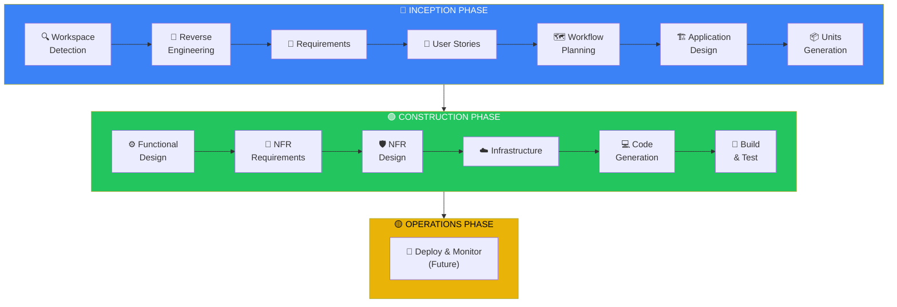
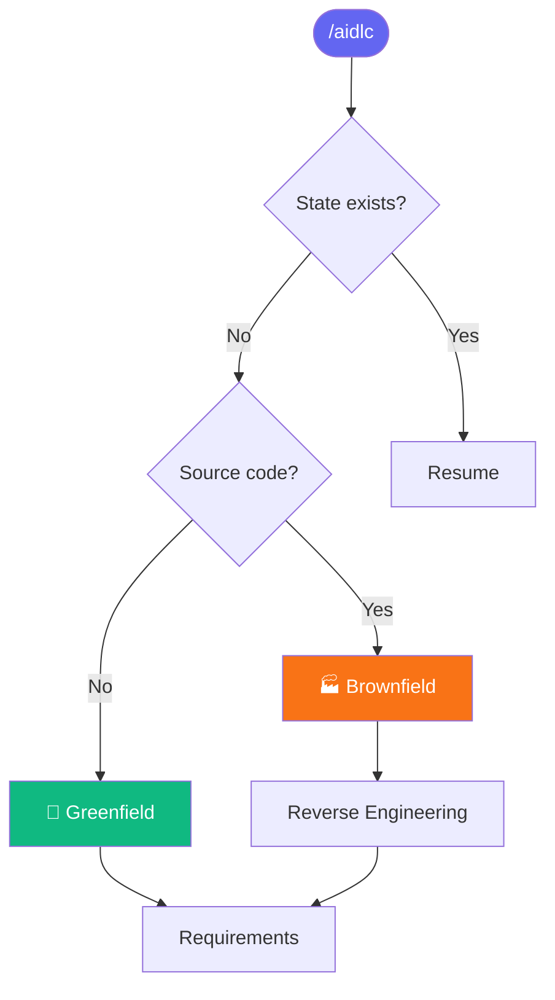

# AIDLC Command System for Cursor

ระบบ Custom Commands สำหรับ Cursor IDE ที่ใช้หลักการ **AI Development Life Cycle (AIDLC)**

## 📋 Overview

AIDLC Command System ช่วยให้คุณพัฒนาซอฟต์แวร์อย่างเป็นระบบโดยใช้ AI เป็นผู้ช่วย ครอบคลุมตั้งแต่การวิเคราะห์ความต้องการไปจนถึงการ generate code

```
🔵 INCEPTION    →  วิเคราะห์ + ออกแบบ (WHAT to build)
🟢 CONSTRUCTION →  สร้าง + ทดสอบ (HOW to build)
🟡 OPERATIONS   →  Deploy + Monitor (Future)
```

---

## 🚀 Quick Start

### 1. เปิด Cursor Chat

กด `Cmd+L` (Mac) หรือ `Ctrl+L` (Windows/Linux)

### 2. พิมพ์ `/` เพื่อดู Commands

Commands ทั้งหมดจะแสดงขึ้นมา

### 3. เริ่มต้นใช้งาน

```
/aidlc
```

AI จะเริ่ม workflow ให้อัตโนมัติ และ progress ผ่าน stages ต่างๆ ตาม context ของ request

---

## 📚 Available Commands

| Command | Description |
|---------|-------------|
| `/aidlc` | 🏁 **Main entry** - เริ่ม, resume, หรือทำงานทุกอย่าง |
| `/aidlc-status` | 📊 **Status** - แสดงสถานะปัจจุบัน |
| `/aidlc-changelog` | 📝 **Changelog** - อัพเดต CHANGELOG.md |
| `/aidlc-multi-repo` | 🔗 **Multi-Repo** - Configure related projects (advanced) |

### ทำไมแค่ 4 Commands?

เพราะ **AIDLC core-workflow** จัดการทุกอย่างอัตโนมัติ:
- ✅ Auto-detect Greenfield/Brownfield
- ✅ Auto-progress ผ่าน stages ที่จำเป็น
- ✅ Auto-skip stages ที่ไม่จำเป็น
- ✅ Resume จาก state file เมื่อ session ใหม่

ไม่จำเป็นต้องมี command แยกสำหรับแต่ละ stage เพราะ `/aidlc` + context ของ request ก็พอแล้ว!

---

## 💡 Usage Examples

### เริ่มโปรเจกต์ใหม่

```
/aidlc สร้าง REST API สำหรับ user authentication
```

AI จะ:
1. ตรวจสอบ workspace (Greenfield หรือ Brownfield)
2. สร้างโครงสร้าง `aidlc-docs/`
3. Progress ผ่าน AIDLC stages อัตโนมัติ

### ดูสถานะปัจจุบัน

```
/aidlc-status
```

### Resume จากที่หยุดไว้

```
/aidlc
```

AI จะอ่าน state จาก `aidlc-docs/state/{branch}.md` และ resume จาก stage ล่าสุด

### ถ้าต้องการข้ามไป stage ไหน

แค่บอก AI ตรงๆ:

```
/aidlc ข้ามไป code generation เลย
```

```
/aidlc re-run requirements analysis
```

---

## 📁 Generated Structure

เมื่อใช้ AIDLC จะสร้างโครงสร้างนี้:

```
your-project/
├── .cursor/
│   └── commands/          # AIDLC commands (this folder)
├── aidlc-docs/            # AIDLC artifacts
│   ├── branches/          # Branch-based artifacts
│   │   └── {branch}/
│   │       ├── inception/
│   │       └── construction/
│   ├── state/             # Branch-based state tracking
│   │   └── {branch}.md
│   └── audit/             # Branch-based audit logs
│       └── {branch}.md
└── [your source code]
```

---

## 🔄 AIDLC Workflow

### Complete Workflow Diagram



### Decision Flow



---

## ⚙️ Configuration

### Project-Level Commands

Commands ใน `.cursor/commands/` จะใช้ได้เฉพาะ project นี้

### Global Commands (Optional)

Copy ไปยัง `~/.cursor/commands/` เพื่อใช้ได้ทุก project:

```bash
cp -r .cursor/commands/* ~/.cursor/commands/
```

---

## ❓ FAQ

### Commands ไม่แสดง?

1. ตรวจสอบว่าไฟล์อยู่ใน `.cursor/commands/`
2. **Restart Cursor IDE**

### ต้องการเริ่มใหม่ทั้งหมด?

```bash
rm -rf aidlc-docs/
/aidlc
```

### ใช้กับโปรเจกต์ที่มี code อยู่แล้ว?

ได้! AI จะตรวจจับเป็น **Brownfield** และเริ่ม Reverse Engineering

### ต้องการทำเฉพาะ stage ไหน?

แค่บอก AI ตรงๆ ใน `/aidlc` command เลย เช่น:
- "ทำ requirements analysis เท่านั้น"
- "skip ไป code generation"
- "re-run user stories"

---

## 📖 Reference

- [Cursor Commands Documentation](https://cursor.com/docs/agent/chat/commands)
- AIDLC Rules: `.cursor/rules/aidlc-rules/`

---

## 📝 Version

| Version | Date | Changes |
|---------|------|---------|
| 2.0 | 2025-12-15 | Simplified to 3 essential commands |
| 1.4 | 2025-12-15 | Added multi-repository support |
| 1.3 | 2025-12-15 | Branch-based audit system |
| 1.2 | 2025-12-15 | CHANGELOG management |
| 1.1 | 2025-12-15 | Helper scripts, distribution guide |
| 1.0 | 2025-12-15 | Initial release |
