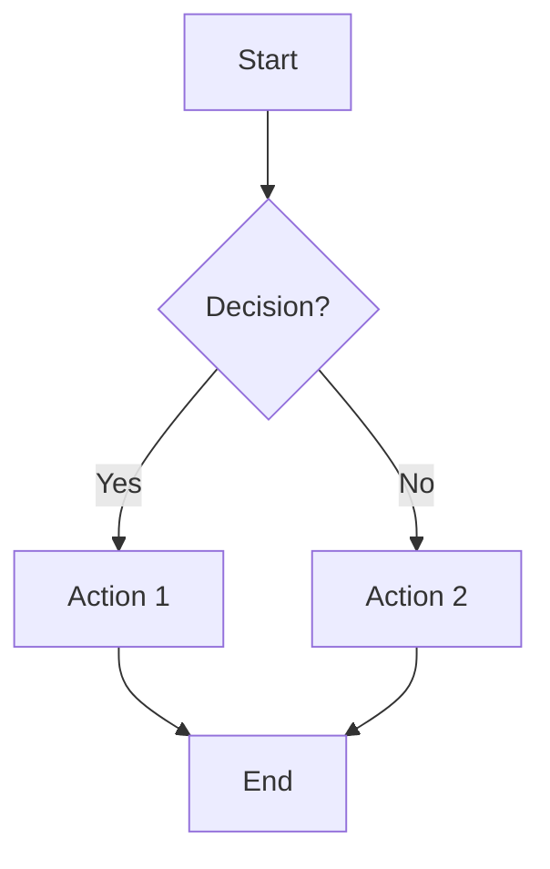
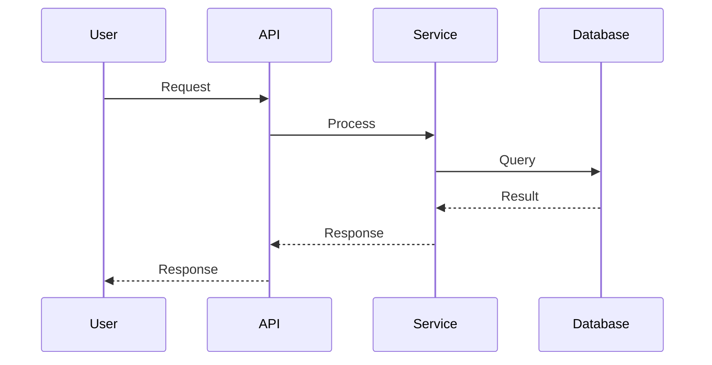
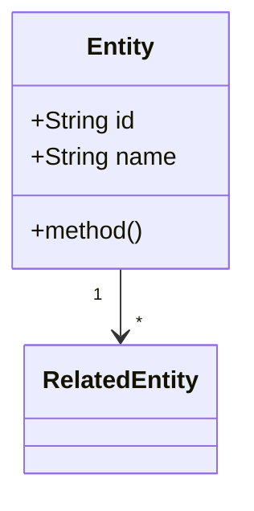

# Content Validation Rules

## MANDATORY: Content Validation Before File Creation

**CRITICAL**: All generated content MUST be validated before writing to files to prevent parsing errors.

---

## 🎨 MANDATORY: Mermaid for All Diagrams

**CRITICAL**: ALL diagrams in AIDLC workflow MUST use Mermaid syntax. No exceptions.

### Why Mermaid?
1. **Text-based**: Can be version controlled and diffed like code
2. **Inline Rendering**: Renders directly in Markdown (GitHub, GitLab, Cursor, VS Code)
3. **AI-Friendly**: AI can easily generate, read, and modify Mermaid syntax
4. **Consistent**: Ensures uniform diagram style across all documentation
5. **Portable**: No external tools or image files required

### Supported Diagram Types
| Diagram Type | Mermaid Syntax | Use Case |
|-------------|----------------|----------|
| **Flowchart** | `flowchart TD/LR` | Workflows, decision flows, process flows |
| **Sequence** | `sequenceDiagram` | API interactions, business transactions, data flows |
| **Class** | `classDiagram` | Domain models, entity relationships, component structures |
| **State** | `stateDiagram-v2` | State machines, lifecycle management |
| **ER Diagram** | `erDiagram` | Database schemas, data models |
| **Gantt** | `gantt` | Project timelines, execution plans |
| **Pie Chart** | `pie` | Distribution visualization |
| **Git Graph** | `gitGraph` | Branch strategies, version flows |
| **Mindmap** | `mindmap` | Concept mapping, brainstorming |
| **Timeline** | `timeline` | Historical events, milestones |

### Diagram Usage Guidelines

**ALWAYS use Mermaid for:**
- Architecture diagrams
- Business context diagrams
- Component dependency diagrams
- Workflow visualizations
- Sequence diagrams (data flow, API interactions)
- Class/Entity diagrams
- State diagrams
- Any visual representation in documentation

**NEVER use:**
- ASCII art diagrams
- External image files for diagrams (PNG, SVG, JPG)
- Third-party diagram tools (Draw.io, Lucidchart) - unless explicitly requested by user
- Plain text boxes to represent flows

### Mermaid Template Examples

**Flowchart (Workflow):**


**Sequence Diagram (Business Transaction):**


**Class Diagram (Domain Model):**


---

## Mermaid Diagram Validation

### Required Validation Steps
1. **Syntax Check**: Validate Mermaid syntax before file creation
2. **Character Escaping**: Ensure special characters are properly escaped
3. **Fallback Content**: Provide text alternative if Mermaid fails validation

### Mermaid Validation Rules
```markdown
## BEFORE creating any file with Mermaid diagrams:

1. Check for invalid characters in node IDs (use alphanumeric + underscore only)
2. Escape special characters in labels: " → \" and ' → \'
3. Validate flowchart syntax: node connections must be valid
4. Test diagram parsing with simple validation

## FALLBACK: If Mermaid validation fails, use text-based workflow representation
```

### Implementation Pattern
```markdown
## Workflow Visualization

### Mermaid Diagram (if syntax valid)
```mermaid
[validated diagram content]
```

### Text Alternative (always include)
```
Phase 1: INCEPTION
- Stage 1: Workspace Detection (COMPLETED)
- Stage 2: Requirements Analysis (COMPLETED)
[continue with text representation]
```

## General Content Validation

### Pre-Creation Validation Checklist
- [ ] Validate embedded code blocks (Mermaid, JSON, YAML)
- [ ] Check special character escaping
- [ ] Verify markdown syntax correctness
- [ ] Test content parsing compatibility
- [ ] Include fallback content for complex elements

### Error Prevention Rules
1. **Always validate before using tools/commands to write files**: Never write unvalidated content
2. **Escape special characters**: Particularly in diagrams and code blocks
3. **Provide alternatives**: Include text versions of visual content
4. **Test syntax**: Validate complex content structures

## Validation Failure Handling

### When Validation Fails
1. **Log the error**: Record what failed validation
2. **Use fallback content**: Switch to text-based alternative
3. **Continue workflow**: Don't block on content validation failures
4. **Inform user**: Mention simplified content was used due to parsing constraints