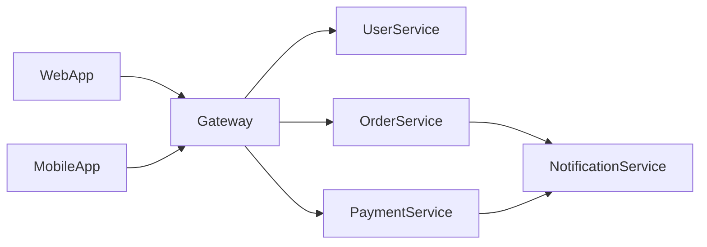

# Multi-Repo Context Management

## Overview

AIDLC supports **multi-repository projects** where frontend, backend, and other services are in separate repos. This guide explains how to configure and work with related repositories.

---

## Configuration File

Create `aidlc-docs/related-projects.md` in your main project:

```markdown
# Related Projects Configuration

## Project Ecosystem

| Project | Type | Path/URL | Description |
|---------|------|----------|-------------|
| my-frontend | Frontend | ../my-frontend | React SPA |
| my-backend | Backend | ../my-backend | Node.js API |
| my-jobs | Jobs | ../my-jobs | Background workers |
| my-shared | Library | ../my-shared | Shared utilities |

## Integration Points

### API Contracts
- **Frontend → Backend**: REST API at `http://localhost:3000/api`
- **Jobs → Backend**: Message queue via RabbitMQ

### Shared Dependencies
- `my-shared` is used by: Frontend, Backend, Jobs
- Common types/interfaces defined in: `my-shared/types/`

## Cross-Repo Notes
[Add notes about how projects interact]
```

---

## How AIDLC Uses This

### During Reverse Engineering (Brownfield)

When AIDLC detects `aidlc-docs/related-projects.md`:

1. **Read Related Projects Config**
   - Parse project paths/URLs
   - Identify project types (frontend, backend, job, library)

2. **Analyze Integration Points**
   - Identify API contracts between projects
   - Map shared dependencies
   - Document message flows

3. **Generate Cross-Repo Documentation**
   - Create `aidlc-docs/inception/reverse-engineering/cross-repo-integration.md`
   - Document how projects interact

### During Requirements Analysis

1. **Consider All Related Projects**
   - "This requirement affects: Frontend, Backend"
   - Map requirements to affected projects

2. **Generate Cross-Project Requirements**
   - Create requirements traceability across repos

### During Code Generation

1. **Check Impact on Related Projects**
   - "Changes to API will require updates in: Frontend"
   - Generate migration notes for other projects

2. **Generate Integration Notes**
   - Document changes needed in other repos
   - Create `aidlc-docs/construction/{unit}/cross-repo-changes.md`

---

## Cursor Workspace Setup

### Option 1: Multi-Root Workspace (Recommended)

Open all related repos in one Cursor workspace:

1. **File → Add Folder to Workspace**
2. Add each related project folder
3. Save workspace as `my-ecosystem.code-workspace`

```json
{
  "folders": [
    { "path": "../my-frontend" },
    { "path": "../my-backend" },
    { "path": "../my-jobs" },
    { "path": "../my-shared" }
  ],
  "settings": {}
}
```

**Benefits:**
- AIDLC can read all projects
- Full code search across repos
- Unified development experience

### Option 2: Primary Project with References

Keep AIDLC in one project, reference others:

1. Create `related-projects.md` (see above)
2. AIDLC will prompt to check other repos when relevant
3. Copy relevant context when needed

---

## Cross-Repo Workflow

### Scenario: New API Endpoint

```
User: "Add a new user profile endpoint"

AIDLC detects related-projects.md and responds:

📋 Cross-Project Impact Analysis

This change affects multiple projects:

| Project | Impact | Action Needed |
|---------|--------|---------------|
| my-backend | Primary | Create endpoint |
| my-frontend | Secondary | Add API call, UI component |
| my-shared | Maybe | Update User type if needed |

Would you like me to:
1. Focus on Backend only (create stubs for Frontend)
2. Generate changes for all affected projects
3. Generate API contract first, then implement in each project
```

### Scenario: Shared Type Change

```
User: "Add 'avatar' field to User type"

AIDLC responds:

📋 Cross-Project Impact Analysis

Changing shared type affects:
- my-shared: Update User interface
- my-backend: Update database schema, API response
- my-frontend: Update UI components, API calls
- my-jobs: Update email templates (if using User)

Recommended approach:
1. Update my-shared first (shared types)
2. Update my-backend (API + DB)
3. Update my-frontend (UI)
4. Update my-jobs (if needed)

Generate changes in this order? [Yes/Customize]
```

---

## Commands for Multi-Repo

### Check Related Projects

```
/aidlc-status
```

Shows:
```markdown
📊 AIDLC Status

**Current Project**: my-backend
**Project Type**: Backend

**Related Projects** (from related-projects.md):
| Project | Type | Path | Status |
|---------|------|------|--------|
| my-frontend | Frontend | ../my-frontend | ✅ Accessible |
| my-jobs | Jobs | ../my-jobs | ✅ Accessible |
| my-shared | Library | ../my-shared | ✅ Accessible |
```

### Analyze Cross-Repo Impact

```
/aidlc-requirements Add payment processing with Stripe
```

AIDLC will automatically:
1. Check `related-projects.md`
2. Analyze impact on each project
3. Generate requirements for all affected projects

---

## Best Practices

### 1. Designate a "Primary" Project

Choose one project to be the primary AIDLC home:
- Usually the **Backend** or **API** project
- Contains the main `aidlc-docs/` folder
- References other projects

### 2. Keep Related Projects Updated

When project structure changes:
```markdown
## Related Projects Configuration

**Last Updated**: 2025-12-15
**Updated By**: @developer

| Project | Type | Path/URL | Description |
|---------|------|----------|-------------|
...
```

### 3. Document Integration Points Clearly

```markdown
## Integration Points

### Frontend → Backend
- **Auth**: POST /api/auth/login → { token, user }
- **Users**: GET /api/users/:id → User
- **Shared Types**: @my-shared/types/User

### Backend → Jobs
- **Queue**: RabbitMQ `email.send`
- **Payload**: { to, template, data }
```

### 4. Use Consistent Naming

Across all repos:
- Same branch naming: `feature/user-profile`
- Same commit format: Conventional Commits
- Same type definitions: from shared library

---

## Limitations

| Limitation | Workaround |
|------------|------------|
| Cannot auto-edit other repos | Generate instructions/patches |
| Limited to local paths | Use git URLs for remote refs |
| One AIDLC state per repo | Designate primary project |

---

## Example: Microservices Setup

```markdown
# Related Projects Configuration

## Microservices Architecture

| Service | Type | Path | Port | Description |
|---------|------|------|------|-------------|
| api-gateway | Gateway | ../api-gateway | 3000 | Kong/NGINX gateway |
| user-service | Backend | ../user-service | 3001 | User management |
| order-service | Backend | ../order-service | 3002 | Order processing |
| payment-service | Backend | ../payment-service | 3003 | Stripe integration |
| notification-service | Jobs | ../notification-service | - | Email/SMS worker |
| web-app | Frontend | ../web-app | 8080 | React SPA |
| mobile-app | Frontend | ../mobile-app | - | React Native |
| shared-types | Library | ../shared-types | - | TypeScript types |

## Service Communication



## Shared Contracts
- OpenAPI specs: `../api-contracts/`
- Protobuf definitions: `../proto/`
- TypeScript types: `../shared-types/`
```

