# Application Architecture Design

**Project**: UI AgentBedrock Test Interface
**Date**: 2025-12-17

---

## 1. System Architecture

```mermaid
graph TB
    subgraph Client["🖥️ Browser"]
        UI[Nuxt 4 Frontend]
    end
    
    subgraph Server["⚙️ Backend Server"]
        GIN[Golang Gin API]
        SSE[SSE Handler]
    end
    
    subgraph AWS["☁️ AWS"]
        AB[AgentBedrock SDK]
        AGENTS[Team Agents]
    end
    
    subgraph Storage["💾 Database"]
        MONGO[(MongoDB)]
    end
    
    UI -->|HTTP/SSE| GIN
    GIN --> SSE
    GIN --> MONGO
    SSE -->|Streaming| AB
    AB --> AGENTS
```



---

## 2. Component Design

### 2.1 Frontend Components (Nuxt 4)


**Key Features:**
- **Auto-Summarize**: Automatically summarizes long conversations (>50k tokens)
- **Clear History**: Manual button to clear all messages in a session
- **Error Display**: Shows errors inline with copy button for troubleshooting
- **Trace Viewer**: ChatGPT-like UI with agent names and duration (ms)

### 2.2 Backend Components (Golang)


---

## 3. Data Models

### 3.1 Session

```go
type Session struct {
    ID        primitive.ObjectID `bson:"_id,omitempty" json:"id"`
    Title     string             `bson:"title" json:"title"`
    CreatedAt time.Time          `bson:"created_at" json:"createdAt"`
    UpdatedAt time.Time          `bson:"updated_at" json:"updatedAt"`
}
```

### 3.2 Message

```go
type Message struct {
    ID        primitive.ObjectID `bson:"_id,omitempty" json:"id"`
    SessionID primitive.ObjectID `bson:"session_id" json:"sessionId"`
    Role      string             `bson:"role" json:"role"` // "user" | "assistant"
    Content   string             `bson:"content" json:"content"`
    Trace     *Trace             `bson:"trace,omitempty" json:"trace,omitempty"`
    CreatedAt time.Time          `bson:"created_at" json:"createdAt"`
}
```

### 3.3 Trace

```go
type Trace struct {
    TraceID     string      `bson:"trace_id" json:"traceId"`
    AgentSteps  []AgentStep `bson:"agent_steps" json:"agentSteps"`
    Error       *ErrorInfo  `bson:"error,omitempty" json:"error,omitempty"`
}

type AgentStep struct {
    StepIndex   int       `bson:"step_index" json:"stepIndex"`
    AgentName   string    `bson:"agent_name" json:"agentName"`
    AgentID     string    `bson:"agent_id,omitempty" json:"agentId,omitempty"`
    Type        string    `bson:"type,omitempty" json:"type,omitempty"` // "thinking" | "action" | "kb" | "collaborator" | "finalizing"
    Action      string    `bson:"action" json:"action"`
    Status      string    `bson:"status" json:"status"` // "running" | "success" | "error"
    Rationale   string    `bson:"rationale,omitempty" json:"rationale,omitempty"`
    Observation string    `bson:"observation,omitempty" json:"observation,omitempty"`
    Input       string    `bson:"input,omitempty" json:"input,omitempty"`
    Output      string    `bson:"output,omitempty" json:"output,omitempty"`
    Duration    int64     `bson:"duration,omitempty" json:"duration,omitempty"` // Duration in milliseconds
    StartTime   time.Time `bson:"start_time" json:"startTime"`
    EndTime     time.Time `bson:"end_time,omitempty" json:"endTime,omitempty"`
}

type ErrorInfo struct {
    Type       string `bson:"type" json:"type"`
    Message    string `bson:"message" json:"message"`
    Source     string `bson:"source" json:"source"` // Lambda function name
    StackTrace string `bson:"stack_trace,omitempty" json:"stackTrace,omitempty"`
}
```

---

## 4. API Design

### 4.1 REST Endpoints

| Method | Endpoint | Description | Request | Response |
|--------|----------|-------------|---------|----------|
| GET | `/api/sessions` | List sessions | - | `Session[]` |
| POST | `/api/sessions` | Create session | `{title}` | `Session` |
| GET | `/api/sessions/:id` | Get session with messages | - | `{session, messages}` |
| DELETE | `/api/sessions/:id` | Delete session | - | `{success}` |
| PUT | `/api/sessions/:id` | Update session title | `{title}` | `Session` |
| DELETE | `/api/sessions/:id/messages` | Clear all messages | - | `{success, message}` |
| GET | `/api/sessions/:id/stats` | Get message count | - | `{message_count}` |

### 4.2 SSE Streaming Endpoint

| Method | Endpoint | Description |
|--------|----------|-------------|
| POST | `/api/chat/stream` | Send message & stream response |

**Request Body:**
```json
{
  "sessionId": "string",
  "message": "string"
}
```

**SSE Events:**
```
event: thinking
data: {"status": "thinking"}

event: summarized
data: {"message": "Conversation history was automatically summarized..."}

event: agent_step
data: {"stepIndex": 1, "agentName": "Researcher", "action": "invoke_model", "status": "running", "duration": 1234}

event: content
data: {"chunk": "Hello, "}

event: agent_step
data: {"stepIndex": 1, "agentName": "Researcher", "action": "invoke_model", "status": "success", "duration": 2345}

event: trace
data: {"traceId": "xxx", "agentSteps": [...]}

event: error
data: {"type": "LambdaError", "message": "...", "source": "..."}

event: done
data: {"messageId": "xxx"}
```

**Auto-Summarize Flow:**
1. Before sending message, estimate token count (~4 chars/token)
2. If estimated tokens > 50,000:
   - Use Claude 3 Haiku to summarize older messages
   - Keep summary + 4 most recent messages
   - Send `summarized` event to notify frontend
3. Continue with reduced context

---

## 5. Directory Structure

```
ui-agentbedrock/
├── frontend/                 # Nuxt 4 Application
│   ├── app/
│   │   ├── components/
│   │   │   ├── chat/
│   │   │   │   ├── MessageList.vue
│   │   │   │   ├── Input.vue
│   │   │   │   ├── AgentSteps.vue
│   │   │   │   ├── TraceViewer.vue
│   │   │   │   └── ErrorDisplay.vue
│   │   │   ├── sidebar/
│   │   │   │   └── SessionSidebar.vue
│   │   │   └── ui/
│   │   │       └── ThemeToggle.vue
│   │   ├── composables/
│   │   │   ├── useChat.ts
│   │   │   ├── useSession.ts
│   │   │   └── useTheme.ts
│   │   ├── pages/
│   │   │   └── index.vue
│   │   └── app.vue
│   ├── nuxt.config.ts
│   ├── tailwind.config.ts
│   └── package.json
├── backend/                  # Golang Gin API
│   ├── cmd/
│   │   └── server/
│   │       └── main.go
│   ├── internal/
│   │   ├── handlers/
│   │   │   ├── chat.go
│   │   │   └── session.go
│   │   ├── services/
│   │   │   ├── agent.go
│   │   │   ├── session.go
│   │   │   └── summarize.go    # NEW: Auto-summarize service
│   │   ├── repository/
│   │   │   └── session.go
│   │   ├── models/
│   │   │   ├── session.go
│   │   │   ├── message.go
│   │   │   └── trace.go
│   │   └── config/
│   │       └── config.go
│   ├── go.mod
│   └── go.sum
├── docker-compose.yml
├── .env.example
└── README.md
```

---

## 6. Technology Decisions

| Decision | Choice | Rationale |
|----------|--------|-----------|
| Streaming | SSE | Simple, HTTP-based, no WebSocket complexity |
| State Management | Nuxt useState | Simple, built-in, sufficient for this app |
| HTTP Client | Native fetch | Built-in, works with SSE |
| CSS | TailwindCSS | Rapid development, consistent styling |
| Icons | Lucide Vue | Modern, lightweight |
| Theme | CSS Variables | Easy switching, performance |

