# Application Architecture Design - Document Upload Feature

**Project**: UI AgentBedrock Test Interface
**Feature**: Document Upload
**Date**: 2025-12-17
**Branch**: main

---

## 1. System Architecture (Updated)

```mermaid
graph TB
    subgraph Client["🖥️ Browser"]
        UI[Nuxt 4 Frontend]
        UPLOAD_UI[Document Upload UI]
    end
    
    subgraph Server["⚙️ Backend Server"]
        GIN[Golang Gin API]
        SSE[SSE Handler]
        UPLOAD_H[Upload Handler]
        EXTRACT_SVC[Extraction Service]
    end
    
    subgraph AWS["☁️ AWS"]
        AB[AgentBedrock SDK]
        AGENTS[Team Agents]
    end
    
    subgraph Storage["💾 Database"]
        MONGO[(MongoDB)]
        GRIDFS[(GridFS)]
    end
    
    UI -->|HTTP/SSE| GIN
    UPLOAD_UI -->|Multipart Form| UPLOAD_H
    GIN --> SSE
    GIN --> UPLOAD_H
    GIN --> MONGO
    UPLOAD_H --> EXTRACT_SVC
    UPLOAD_H --> GRIDFS
    EXTRACT_SVC --> MONGO
    SSE -->|Streaming| AB
    AB --> AGENTS
```



---

## 2. Component Design

### 2.1 Frontend Components (Updated)


**New Components:**
- **DocumentUpload.vue**: File picker and drag-drop upload interface
- **DocumentList.vue**: Display attached documents with remove functionality
- **useDocumentUpload.ts**: Composable for upload logic and state management

**Updated Components:**
- **Input.vue**: Integrate document upload UI
- **MessageList.vue**: Display documents in message history
- **useChat.ts**: Handle document IDs in message sending

---

### 2.2 Backend Components (Updated)


**New Components:**
- **UploadHandler**: Handle multipart form uploads, validation
- **ExtractionService**: Extract text from PDF, DOCX, TXT files
- **DocumentRepository**: CRUD operations for documents, GridFS integration

**Updated Components:**
- **ChatHandler**: Include document content in message context
- **SessionRepository**: Link documents to sessions

---

## 3. Data Models

### 3.1 Document (New)

```go
type Document struct {
    ID        primitive.ObjectID `bson:"_id,omitempty" json:"id"`
    SessionID primitive.ObjectID `bson:"session_id" json:"sessionId"`
    MessageID primitive.ObjectID `bson:"message_id,omitempty" json:"messageId,omitempty"`
    Filename  string             `bson:"filename" json:"filename"`
    FileType  string             `bson:"file_type" json:"fileType"` // "pdf", "docx", "txt", "md"
    FileSize  int64              `bson:"file_size" json:"fileSize"` // bytes
    Content   string             `bson:"content,omitempty" json:"content,omitempty"` // Extracted text
    GridFSID  primitive.ObjectID `bson:"gridfs_id,omitempty" json:"gridfsId,omitempty"`
    CreatedAt time.Time          `bson:"created_at" json:"createdAt"`
}
```

### 3.2 Message (Updated)

```go
type Message struct {
    ID        primitive.ObjectID `bson:"_id,omitempty" json:"id"`
    SessionID primitive.ObjectID `bson:"session_id" json:"sessionId"`
    Role      string             `bson:"role" json:"role"` // "user" | "assistant"
    Content   string             `bson:"content" json:"content"`
    Documents []primitive.ObjectID `bson:"documents,omitempty" json:"documents,omitempty"` // NEW
    Trace     *Trace             `bson:"trace,omitempty" json:"trace,omitempty"`
    CreatedAt time.Time          `bson:"created_at" json:"createdAt"`
}
```

### 3.3 ChatRequest (Updated)

```go
type ChatRequest struct {
    SessionID   string   `json:"sessionId" binding:"required"`
    Message     string   `json:"message" binding:"required"`
    DocumentIDs []string `json:"documentIds,omitempty"` // NEW
}
```

### 3.4 UploadRequest (New)

```go
type UploadRequest struct {
    SessionID string `form:"sessionId" binding:"required"`
    File      *multipart.FileHeader `form:"file" binding:"required"`
}
```

### 3.5 UploadResponse (New)

```go
type UploadResponse struct {
    DocumentID string `json:"documentId"`
    Filename   string `json:"filename"`
    FileType   string `json:"fileType"`
    FileSize   int64  `json:"fileSize"`
    Content    string `json:"content,omitempty"` // Extracted text preview
}
```

---

## 4. API Design

### 4.1 New REST Endpoints

| Method | Endpoint | Description | Request | Response |
|--------|----------|-------------|---------|----------|
| POST | `/api/upload` | Upload document file | `multipart/form-data` | `UploadResponse` |
| GET | `/api/files/:id` | Download file | - | `file` |
| DELETE | `/api/files/:id` | Delete file | - | `{success}` |
| GET | `/api/sessions/:id/documents` | List documents in session | - | `Document[]` |

### 4.2 Updated Endpoints

| Method | Endpoint | Description | Request | Response |
|--------|----------|-------------|---------|----------|
| POST | `/api/chat/stream` | Send message & stream response | `ChatRequest` (with `documentIds`) | SSE stream |

### 4.3 Upload Endpoint Details

**POST `/api/upload`**

**Request:**
- Content-Type: `multipart/form-data`
- Fields:
  - `sessionId`: string (required)
  - `file`: file (required, max 10MB)

**Response:**
```json
{
  "documentId": "507f1f77bcf86cd799439011",
  "filename": "report.pdf",
  "fileType": "pdf",
  "fileSize": 1024000,
  "content": "Extracted text preview..."
}
```

**Error Responses:**
- `400 Bad Request`: Invalid file type, file too large, missing fields
- `413 Payload Too Large`: File exceeds size limit
- `500 Internal Server Error`: Upload or extraction failure

---

## 5. Document Processing Flow


---

## 6. Directory Structure (Updated)

```
ui-agentbedrock/
├── frontend/
│   ├── app/
│   │   ├── components/
│   │   │   ├── chat/
│   │   │   │   ├── MessageList.vue
│   │   │   │   ├── Input.vue
│   │   │   │   ├── AgentSteps.vue
│   │   │   │   ├── TraceViewer.vue
│   │   │   │   ├── ErrorDisplay.vue
│   │   │   │   ├── DocumentUpload.vue      # NEW
│   │   │   │   └── DocumentList.vue        # NEW
│   │   │   ├── sidebar/
│   │   │   │   └── SessionSidebar.vue
│   │   │   └── ui/
│   │   │       └── ThemeToggle.vue
│   │   ├── composables/
│   │   │   ├── useChat.ts                  # UPDATED
│   │   │   ├── useSession.ts
│   │   │   ├── useTheme.ts
│   │   │   └── useDocumentUpload.ts        # NEW
│   │   ├── pages/
│   │   │   └── index.vue
│   │   └── app.vue
│   └── ...
├── backend/
│   ├── cmd/
│   │   └── server/
│   │       └── main.go                     # UPDATED (add upload routes)
│   ├── internal/
│   │   ├── handlers/
│   │   │   ├── chat.go                     # UPDATED (document context)
│   │   │   ├── session.go
│   │   │   └── upload.go                   # NEW
│   │   ├── services/
│   │   │   ├── agent.go
│   │   │   ├── session.go
│   │   │   ├── summarize.go
│   │   │   └── extraction.go               # NEW
│   │   ├── repository/
│   │   │   ├── session.go
│   │   │   └── document.go                 # NEW
│   │   ├── models/
│   │   │   ├── session.go
│   │   │   ├── message.go                  # UPDATED
│   │   │   ├── trace.go
│   │   │   └── document.go                 # NEW
│   │   └── config/
│   │       └── config.go
│   └── ...
└── ...
```

---

## 7. Technology Decisions

| Decision | Choice | Rationale |
|----------|--------|-----------|
| File Storage | MongoDB GridFS | Integrated with existing MongoDB, simple setup, sufficient for MVP |
| PDF Extraction | `github.com/gen2brain/go-fitz` | Lightweight, pure Go, good performance |
| DOCX Extraction | `github.com/unidoc/unioffice` | Comprehensive Office format support |
| Upload Method | Multipart Form | Standard HTTP, works with all browsers |
| File Validation | Content-based + Extension | Security best practice |
| Max File Size | 10MB per file, 50MB total | Balance between usability and performance |

---

## 8. Security Considerations

1. **File Type Validation**: Check MIME type, not just extension
2. **File Size Limits**: Enforce 10MB per file, 50MB total per message
3. **Content Scanning**: Validate file content matches declared type
4. **Session Scoping**: Documents linked to sessions, deleted with session
5. **Access Control**: Documents only accessible within their session context

---

## 9. Performance Considerations

1. **Async Processing**: Text extraction can be async (future enhancement)
2. **Chunked Upload**: For large files (future enhancement)
3. **Caching**: Cache extracted text in document model
4. **GridFS Streaming**: Stream large files without loading into memory
5. **Progress Tracking**: Real-time upload progress via SSE (future enhancement)

---

## 10. Error Handling

1. **Upload Errors**: Clear error messages for validation failures
2. **Extraction Errors**: Graceful fallback, log errors for debugging
3. **Storage Errors**: Retry logic for GridFS operations
4. **Network Errors**: Frontend retry mechanism for failed uploads
5. **Context Errors**: Fallback to message-only if document context fails

---

## 11. Integration Points

### 11.1 Chat Integration
- Document content is prepended to user message as context block
- Format: `[Document Context]\n{document content}\n\n[User Message]\n{message}`
- Multiple documents are combined into single context block

### 11.2 Session Integration
- Documents are linked to sessions via `SessionID`
- Documents are deleted when session is deleted
- Documents can be referenced across multiple messages in same session

### 11.3 Message Integration
- Messages can have multiple documents attached
- Documents are displayed in message history
- Document metadata is stored with message

---

## 12. Future Enhancements

1. **Image Support**: OCR for images using AWS Textract
2. **S3 Storage**: Migrate from GridFS to S3 for better scalability
3. **Async Extraction**: Background processing for large documents
4. **Document Preview**: Inline preview for PDFs and images
5. **Document Search**: Full-text search across uploaded documents
6. **Document Sharing**: Share documents between sessions (optional)

