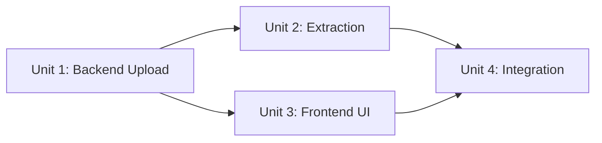

# Units of Work - Document Upload Feature

**Project**: UI AgentBedrock Test Interface
**Feature**: Document Upload
**Date**: 2025-12-17
**Branch**: main

---

## Units Overview

This document defines the units of work for implementing the document upload feature. Units are organized to minimize dependencies and enable parallel development where possible.

---

## Unit 1: Backend Upload & Storage

**Purpose**: Handle file uploads, validation, and storage in MongoDB GridFS

**Scope**:
- File upload endpoint (`POST /api/upload`)
- File validation (type, size, content)
- MongoDB GridFS integration
- Document metadata storage
- File download endpoint (`GET /api/files/:id`)
- File deletion endpoint (`DELETE /api/files/:id`)

**Components**:
- `models/document.go` - Document data model
- `repository/document.go` - Document repository with GridFS operations
- `handlers/upload.go` - Upload handler for multipart form processing
- File validation utilities

**Dependencies**: None (foundation unit)

**Deliverables**:
- [ ] Document model
- [ ] Document repository with GridFS integration
- [ ] Upload handler with validation
- [ ] API endpoints for upload, download, delete
- [ ] Error handling for upload failures

**Estimated Effort**: 30% of total

---

## Unit 2: Text Extraction Service

**Purpose**: Extract text content from various document formats

**Scope**:
- PDF text extraction
- DOCX text extraction
- TXT/MD file reading
- Error handling for extraction failures
- Extraction service interface

**Components**:
- `services/extraction.go` - Extraction service
- PDF extraction implementation
- DOCX extraction implementation
- TXT/MD reader implementation

**Dependencies**: Unit 1 (needs Document model)

**Deliverables**:
- [ ] Extraction service interface
- [ ] PDF extractor (using go-fitz)
- [ ] DOCX extractor (using unidoc/unioffice)
- [ ] TXT/MD reader
- [ ] Error handling and logging

**Estimated Effort**: 20% of total

---

## Unit 3: Frontend Upload UI

**Purpose**: User interface for document upload

**Scope**:
- File picker component
- Drag-and-drop upload
- Upload progress indicator
- Document list display
- Error display for upload failures
- Integration with chat input

**Components**:
- `components/chat/DocumentUpload.vue` - Upload component
- `components/chat/DocumentList.vue` - Document list component
- `composables/useDocumentUpload.ts` - Upload logic composable
- Updates to `components/chat/Input.vue`

**Dependencies**: Unit 1 (needs upload API)

**Deliverables**:
- [ ] DocumentUpload component (file picker + drag-drop)
- [ ] DocumentList component (show attached documents)
- [ ] useDocumentUpload composable
- [ ] Progress indicator
- [ ] Error handling UI
- [ ] Integration with Input component

**Estimated Effort**: 25% of total

---

## Unit 4: Document Integration

**Purpose**: Integrate documents with chat flow and AgentBedrock

**Scope**:
- Update Message model to include documents
- Update ChatRequest to include documentIds
- Update ChatHandler to include document content in context
- Update frontend to send documents with messages
- Display documents in chat history
- Context preparation logic

**Components**:
- Updates to `models/message.go`
- Updates to `handlers/chat.go`
- Updates to `composables/useChat.ts`
- Updates to `components/chat/MessageList.vue`

**Dependencies**: Unit 1, Unit 2, Unit 3 (needs all previous units)

**Deliverables**:
- [ ] Updated Message model (documents field)
- [ ] Updated ChatRequest model (documentIds field)
- [ ] Updated ChatHandler (document context preparation)
- [ ] Updated useChat composable (handle document uploads)
- [ ] Updated MessageList component (display documents)
- [ ] Context preparation logic

**Estimated Effort**: 25% of total

---

## Execution Order

```
Unit 1 (Backend Upload & Storage)
    ↓
Unit 2 (Text Extraction Service)
    ↓
Unit 3 (Frontend Upload UI)
    ↓
Unit 4 (Document Integration)
```

**Note**: Units must be executed sequentially due to dependencies.

---

## Unit Dependencies Graph



---

## Testing Strategy

### Unit 1 Testing
- File upload endpoint tests
- File validation tests
- GridFS storage tests
- Error handling tests

### Unit 2 Testing
- PDF extraction tests
- DOCX extraction tests
- TXT reading tests
- Error handling tests

### Unit 3 Testing
- Component rendering tests
- Upload flow tests
- Error display tests
- Integration tests with backend

### Unit 4 Testing
- End-to-end upload and chat flow
- Document context in messages
- Document display in history
- Multiple document handling

---

## Success Criteria

- [ ] Unit 1: Files can be uploaded, validated, and stored
- [ ] Unit 2: Text can be extracted from PDF, DOCX, TXT files
- [ ] Unit 3: Users can upload files via UI with progress feedback
- [ ] Unit 4: Documents are included in chat context and displayed in history

---

## Notes

- Units are designed to be testable independently
- Each unit builds on previous units
- Unit 4 is the integration point that brings everything together
- Error handling is built into each unit
- Performance considerations are addressed in each unit

