# Workflow Execution Plan - Document Upload Feature

**Project**: UI AgentBedrock Test Interface
**Feature**: Document Upload
**Date**: 2025-12-17
**Branch**: main
**Mode**: Standard (Feature Addition to Existing System)

---

## Execution Summary

```mermaid
graph TB
    subgraph INCEPTION["🔵 INCEPTION PHASE"]
        WD[Workspace Detection ✅]
        RA[Requirements Analysis ✅]
        US[User Stories ✅]
        WP[Workflow Planning 🔄]
        AD[Application Design ⏭️]
        UG[Units Generation ⏭️]
    end
    
    subgraph CONSTRUCTION["🟢 CONSTRUCTION PHASE"]
        subgraph UNIT1["Unit 1: Backend Upload & Storage"]
            FD1[Functional Design ⏭️]
            NFR1[NFR Requirements ⏭️]
            NFRD1[NFR Design ⏭️]
            INF1[Infrastructure Design ⏭️]
            CG1[Code Generation ⏭️]
        end
        
        subgraph UNIT2["Unit 2: Text Extraction Service"]
            FD2[Functional Design ⏭️]
            NFR2[NFR Requirements ⏭️]
            CG2[Code Generation ⏭️]
        end
        
        subgraph UNIT3["Unit 3: Frontend Upload UI"]
            FD3[Functional Design ⏭️]
            CG3[Code Generation ⏭️]
        end
        
        subgraph UNIT4["Unit 4: Document Integration"]
            FD4[Functional Design ⏭️]
            CG4[Code Generation ⏭️]
        end
        
        BT[Build and Test ⏭️]
    end
    
    WD --> RA --> US --> WP
    WP --> AD --> UG
    
    UG --> UNIT1
    UNIT1 --> UNIT2
    UNIT2 --> UNIT3
    UNIT3 --> UNIT4
    UNIT4 --> BT
    
    style WP fill:#90EE90
    style AD fill:#FFE4B5
    style UG fill:#FFE4B5
    style FD1 fill:#FFE4B5
    style CG1 fill:#FFE4B5
    style CG2 fill:#FFE4B5
    style CG3 fill:#FFE4B5
    style CG4 fill:#FFE4B5
    style BT fill:#FFE4B5
```



---

## Stage Execution Plan

| Stage | Status | Depth | Rationale |
|-------|--------|-------|-----------|
| **INCEPTION PHASE** |
| Workspace Detection | ✅ Complete | - | Already executed |
| Requirements Analysis | ✅ Complete | Standard | Comprehensive requirements documented |
| User Stories | ✅ Complete | Standard | 10 stories with 3 personas created |
| Workflow Planning | 🔄 In Progress | Standard | This document |
| Application Design | ⏭️ Execute | Standard | New components needed (Document model, Upload handler, Extraction service) |
| Units Generation | ⏭️ Execute | Standard | Multiple units for structured implementation |
| **CONSTRUCTION PHASE** |
| **Unit 1: Backend Upload & Storage** |
| Functional Design | ⏭️ Execute | Standard | File upload, validation, GridFS storage logic |
| NFR Requirements | ⏭️ Execute | Minimal | Security, performance for file uploads |
| NFR Design | ⏭️ Execute | Minimal | Security patterns, performance optimization |
| Infrastructure Design | ⏭️ Execute | Minimal | GridFS configuration, storage limits |
| Code Generation | ⏭️ Execute | Full | Upload handler, document repository, models |
| **Unit 2: Text Extraction Service** |
| Functional Design | ⏭️ Execute | Standard | PDF, DOCX, TXT extraction logic |
| NFR Requirements | ⏭️ Skip | - | Simple extraction, no special NFRs |
| NFR Design | ⏭️ Skip | - | Standard extraction patterns |
| Code Generation | ⏭️ Execute | Full | Extraction service with library integration |
| **Unit 3: Frontend Upload UI** |
| Functional Design | ⏭️ Execute | Minimal | UI components, upload flow |
| Code Generation | ⏭️ Execute | Full | Upload component, file picker, drag-drop |
| **Unit 4: Document Integration** |
| Functional Design | ⏭️ Execute | Standard | Integration with chat, context preparation |
| Code Generation | ⏭️ Execute | Full | Update chat handler, message model, frontend integration |
| **Build and Test** | ⏭️ Execute | Standard | Test upload, extraction, integration |

---

## Units Breakdown

### Unit 1: Backend Upload & Storage
**Purpose**: Handle file uploads, validation, and storage in MongoDB GridFS

**Components**:
- `Document` model (metadata + GridFS reference)
- `DocumentRepository` (CRUD operations, GridFS integration)
- `UploadHandler` (multipart form handling, validation)
- File validation service (type, size, content validation)
- API endpoints: `POST /api/upload`, `GET /api/files/:id`, `DELETE /api/files/:id`

**Dependencies**: MongoDB GridFS driver

**Estimated Effort**: 30% of total

---

### Unit 2: Text Extraction Service
**Purpose**: Extract text content from various document formats

**Components**:
- `ExtractionService` (interface for different extractors)
- PDF extractor (using go-fitz or pdfcpu)
- DOCX extractor (using unioffice or go-docx)
- TXT/MD reader (native Go)
- Error handling for extraction failures

**Dependencies**: 
- PDF library: `github.com/gen2brain/go-fitz` or `github.com/pdfcpu/pdfcpu`
- DOCX library: `github.com/unidoc/unioffice` or `github.com/lukasjarosch/go-docx`

**Estimated Effort**: 20% of total

---

### Unit 3: Frontend Upload UI
**Purpose**: User interface for document upload

**Components**:
- `DocumentUpload.vue` component (file picker + drag-drop)
- `DocumentList.vue` component (show attached documents)
- `useDocumentUpload.ts` composable (upload logic, state management)
- Progress indicator component
- Error display for upload failures
- Integration with existing `Input.vue` component

**Dependencies**: None (uses existing Nuxt 4 + TailwindCSS)

**Estimated Effort**: 25% of total

---

### Unit 4: Document Integration
**Purpose**: Integrate documents with chat flow and AgentBedrock

**Components**:
- Update `Message` model (add `documents` field)
- Update `ChatRequest` model (add `documentIds` field)
- Update `ChatHandler` (include document content in context)
- Update `useChat.ts` (handle document uploads in message flow)
- Update `MessageList.vue` (display documents in chat history)
- Context preparation logic (combine document content with user message)

**Dependencies**: Units 1, 2, 3

**Estimated Effort**: 25% of total

---

## Execution Sequence

### Phase 1: Foundation (Unit 1)
1. Application Design - Document model, repository, handler design
2. Functional Design - Upload flow, validation logic
3. NFR Requirements - Security, performance requirements
4. NFR Design - Security patterns, optimization strategies
5. Infrastructure Design - GridFS setup
6. Code Generation - Backend upload infrastructure

### Phase 2: Processing (Unit 2)
1. Functional Design - Extraction logic for each format
2. Code Generation - Extraction service implementation

### Phase 3: User Interface (Unit 3)
1. Functional Design - UI components and user flow
2. Code Generation - Frontend upload components

### Phase 4: Integration (Unit 4)
1. Functional Design - Chat integration, context preparation
2. Code Generation - Update existing components, integration logic

### Phase 5: Testing
1. Build and Test - End-to-end testing of upload flow

---

## Dependencies Graph

```
Application Design
    ↓
Units Generation
    ↓
┌─────────────────────────────────────┐
│  Unit 1: Backend Upload & Storage   │
└─────────────────────────────────────┘
    ↓
┌─────────────────────────────────────┐
│  Unit 2: Text Extraction Service   │
└─────────────────────────────────────┘
    ↓
┌─────────────────────────────────────┐
│  Unit 3: Frontend Upload UI        │
└─────────────────────────────────────┘
    ↓
┌─────────────────────────────────────┐
│  Unit 4: Document Integration      │
└─────────────────────────────────────┘
    ↓
Build and Test
```

---

## Risk Assessment

| Risk | Impact | Mitigation |
|------|--------|------------|
| Text extraction library compatibility | High | Research and test libraries early, have fallback options |
| Large file upload performance | Medium | Implement chunked upload, progress tracking, async processing |
| GridFS storage limits | Medium | Monitor storage usage, implement cleanup jobs |
| Document content size in AgentBedrock context | Medium | Truncate or summarize very large documents |
| Multiple file upload complexity | Low | Start with single file, add multiple file support incrementally |

---

## Success Criteria

- [ ] Users can upload PDF, DOCX, TXT files via UI
- [ ] Files are validated (type, size) before processing
- [ ] Text is successfully extracted from all supported formats
- [ ] Documents are stored in GridFS and linked to sessions
- [ ] Document content is included in AgentBedrock messages
- [ ] Documents are displayed in chat history
- [ ] Error handling works for all failure scenarios
- [ ] Upload performance is acceptable (<5s for 1MB file)

---

## Estimated Timeline

| Phase | Duration Estimate |
|-------|------------------|
| Application Design | 1-2 hours |
| Units Generation | 30 minutes |
| Unit 1: Backend Upload | 4-6 hours |
| Unit 2: Text Extraction | 3-4 hours |
| Unit 3: Frontend UI | 3-4 hours |
| Unit 4: Integration | 3-4 hours |
| Build and Test | 2-3 hours |
| **Total** | **16-23 hours** |

---

## Notes

- This is a feature addition to an existing brownfield project
- Existing architecture and patterns should be followed
- MongoDB GridFS is chosen for initial implementation (can migrate to S3 later)
- Text extraction libraries need to be evaluated and tested
- MVP focuses on PDF, DOCX, TXT (images can be added later)
- Error handling is critical for good user experience

