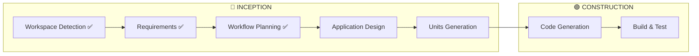

# Workflow Execution Plan

**Project**: UI AgentBedrock Test Interface
**Date**: 2025-12-17
**Mode**: Fast-Track

---

## Execution Summary

---

## Stage Execution Plan

| Stage | Status | Depth | Notes |
|-------|--------|-------|-------|
| Workspace Detection | ✅ Complete | - | Greenfield project |
| Requirements Analysis | ✅ Complete | Standard | 8 FR, 3 NFR documented |
| User Stories | ⏭️ Skip | - | Fast-track mode |
| Workflow Planning | ✅ Complete | Minimal | This document |
| Application Design | ✅ Complete | Standard | Component architecture |
| Units Generation | ✅ Complete | Minimal | 3 units: Frontend + Backend + Infra |
| Functional Design | ⏭️ Skip | - | Simple project |
| NFR Requirements | ⏭️ Skip | - | Standard patterns |
| NFR Design | ⏭️ Skip | - | Standard patterns |
| Infrastructure Design | ⏭️ Skip | - | Docker Compose only |
| Code Generation | ✅ Complete | Full | All code generated |
| Build & Test | ✅ Complete | Standard | E2E tested |

---

## Units Breakdown

### Unit 1: Backend (Golang Gin)
- MongoDB connection
- Session CRUD APIs
- AgentBedrock SDK integration
- SSE streaming endpoint

### Unit 2: Frontend (Nuxt 4)
- Chat UI components
- Theme support
- Session management UI
- Streaming client
- Trace viewer

### Unit 3: Infrastructure
- Docker Compose configuration
- Environment setup

---

## Estimated Effort

| Unit | Estimated Time |
|------|---------------|
| Backend | 40% |
| Frontend | 50% |
| Infrastructure | 10% |
| **Total** | 100% |

